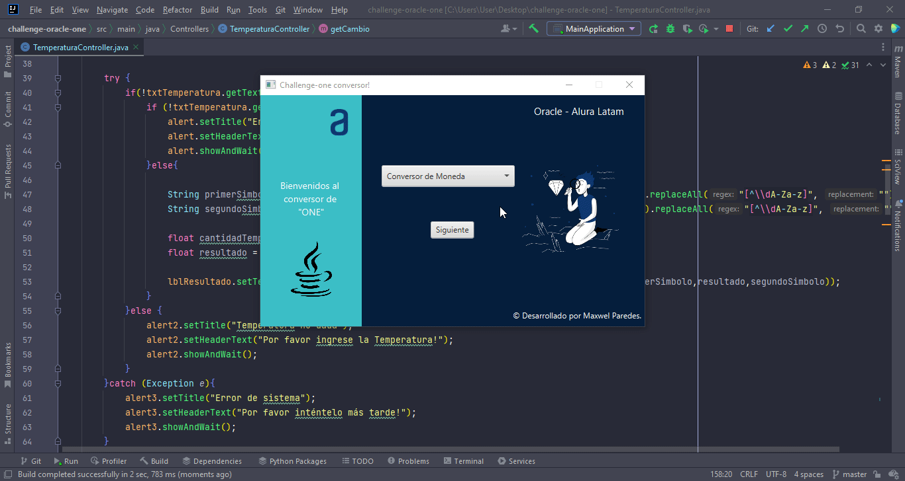

# challenge-oracle-ONE
<h1 align="center">Projecto conversor</h1>
 
Software que permite la conversión entre divisas, temperaturas y masas.
 

   

## 🚀 Funcionalidades del proyecto

- `Conversor de Divisas`: Permite que el usuario pueda intercambiar valores monetarios de un país a otro mediante una API fixer.com
- `Conversor de Temperaturas`: Permite al usuario intercambiar valores entre los diferentes tipos de temperaturas.
- `Conversor de Masas`: Permite al usuario intercambiar valores entre los diferentes tipos de masas.

## 🛠️ Abre y ejecuta el proyecto
- clonar el repositorio https://github.com/Welll192/challenge-oracle-ONE.git
- Ejecutar MainApplication
- Click Run > edit configuration > Modify options > add VM options
- Pegar: --module-path "\path\to\javafx-sdk-19\lib" --add-modules javafx.controls,javafx.fxml
- cambiar \path\to\javafx-sdk-19\lib por la ubicacion que se obtiene al descargar el SDK de javafx en https://gluonhq.com/products/javafx/
  Ejemplo:

## ✅ Tecnologías utilizdas
- `Java 18`
- `Java FX`
- `okhttp`
- `json`

## 📷 Demo

## 🔧 Ejecutable JAR
- instalar: https://download.oracle.com/java/18/archive/jdk-18.0.2.1_windows-x64_bin.exe (sha256)
Para poder ejecutar el archivo jar.

## Autores
[ Maxwel Paredes](https://github.com/Welll192)